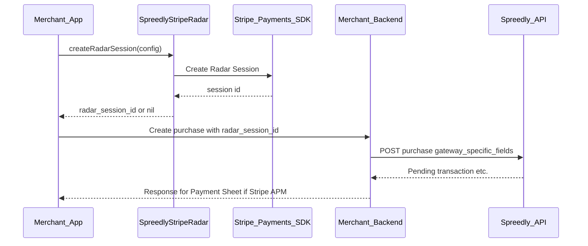

# Stripe Radar Integration Guide

Collect Stripe Radar device data on iOS using the **SpreedlyStripeRadar** module. The SDK creates a Radar session and returns a session ID for your backend to attach to Spreedly purchase or authorization requests.

**Estimated integration time:** ~10 minutes

## Scope — one job only

**SpreedlyStripeRadar does exactly one thing:** ask Stripe for a Radar Session and return a `radar_session_id` string (or `nil` on failure). That is the entire module.

| This module **does** | This module **does not** |
|----------------------|---------------------------|
| Create a Radar session ID (`rse_…`) | Present Payment Sheet or any payment UI |
| Return the ID to your app (Swift `async` or ObjC completion) | Tokenize cards, bank accounts, or APMs |
| Run headless — no views, no sheets | Call Spreedly purchase/authorize APIs |
| Coexist safely with **SpreedlyStripeAPM** on the same app | Replace **SpreedlyStripeAPM**, **SpreedlyCore**, or card tokenization |

**What you still need elsewhere:**

- **`SpreedlyCore`** — SDK init, tokenization, and your normal checkout path.
- **Your backend** — attach `gateway_specific_fields.stripe_payment_intents.radar_session_id` on the Spreedly transaction when you have a session ID.
- **`SpreedlyStripeAPM`** — **optional.** Only if you use Stripe Payment Sheet (iDEAL, Bancontact, etc.). Radar-only integrations (e.g. card tokenize + backend purchase with GSF) do **not** need the APM module.
- **Stripe's SDK on your app target** — link **`StripePayments`** from [stripe-ios-spm](https://github.com/stripe/stripe-ios-spm) on the **app** target (not only the Spreedly package). See [Link StripePayments on your app target](#link-stripepayments-on-your-app-target). Without it, the app can crash at launch on device with a `dyld: Library not loaded` error for `StripePayments` or `StripeCore`.

If you expected Radar to charge, show UI, or complete checkout by itself, use [Stripe APM](stripe-apm.md) or [Express Checkout](express-checkout.md) for payment — and add Radar only when you need the fraud session ID.

## Table of Contents

1. [Introduction](#introduction)
2. [Stripe Radar vs Other SDK Features](#stripe-radar-vs-other-sdk-features)
3. [Prerequisites](#prerequisites)
4. [Installation](#installation)
5. [How Stripe Radar Works](#how-stripe-radar-works)
6. [Backend Requirements](#backend-requirements)
7. [Swift Integration](#swift-integration)
8. [Objective-C Integration](#objective-c-integration)
9. [Stripe Connect (Optional)](#stripe-connect-optional)
10. [Error Handling](#error-handling)
11. [Testing](#testing)
12. [Troubleshooting](#troubleshooting)
13. [API Reference](#api-reference)
14. [Iframe to iOS migration](#iframe-to-ios-migration)
15. [Related Documentation](#related-documentation)

---

## Introduction

### What is Stripe Radar in this SDK?

Stripe Radar uses device signals to help detect fraud. **SpreedlyStripeRadar** exposes **Radar Session creation only**: your app obtains a `radar_session_id` from Stripe, then passes that ID to Spreedly on the **next** API call (typically the Stripe Payment Intents purchase your backend creates for [Stripe APM](stripe-apm.md)).

### Key points

- **Single API surface** — one call: `createRadarSession`. Output is a session ID or `nil`; nothing else.
- **Not a checkout flow** — no Payment Sheet, no Spreedly payment result, no UI from this module.
- **Pre-payment helper** — collect before or while preparing the purchase; your backend sends the session ID on the next Spreedly API call.
- **Optional module** — add **SpreedlyStripeRadar** only when you need Radar; independent of **SpreedlyStripeAPM**.
- **Coexists with Stripe APM** — optional pairing on the same screen; uses a per-call Stripe client and does **not** mutate Stripe's shared API client.

---

## Stripe Radar vs Other SDK Features

| Feature | Stripe Radar (this guide) | Stripe APM | Braintree APM |
|---------|---------------------------|------------|---------------|
| **Purpose** | Device fingerprint / Radar session ID | Payment Sheet (iDEAL, Bancontact, etc.) | PayPal / Venmo native checkout |
| **Primary output** | `radar_session_id` (string or nil) | Pending transaction + `client_secret` | Nonce + device data (confirm flow) |
| **SPM / CocoaPods product** | `SpreedlyStripeRadar` | `SpreedlyStripeAPM` | `SpreedlyBraintree` |
| **Typical timing** | Before backend creates Stripe PI purchase | After backend returns pending purchase | After backend returns pending purchase |
| **Gateway-specific field** | `stripe_payment_intents.radar_session_id` | (none from Radar) | Braintree-specific blocks |

Radar complements Stripe APM when you use both: collect a session ID early, include it in the same pending purchase request your backend sends for Payment Sheet flows. **Radar alone is valid** for card-only or backend-driven checkout — you do not need Stripe APM in the app.

---

## Prerequisites

1. Complete [getting-started.md](getting-started.md) (installation, `Spreedly.initializeSDK()` / signed setup).
2. **Stripe publishable key** (`pk_test_...` or `pk_live_...`) aligned with your Stripe Payment Intents gateway in Spreedly.
3. **Radar Session** enabled for your Stripe account (confirm in Stripe Dashboard / Radar settings).
4. **Minimum iOS** — See the root README modules list. When adding `stripe-ios-spm` on the app, use **25.x** only (`from: "25.11.0"`) — see [Stripe version (required)](#stripe-version-required).

---

## Installation

Add **SpreedlyStripeRadar** when you need Radar session IDs. You may also add **SpreedlyStripeAPM** if you use Payment Sheet — the two modules are independent. Follow [getting-started.md — Install](getting-started.md#installation) for GitHub Packages / SPM / CocoaPods setup.

### Swift Package Manager

```swift
dependencies: [
    .package(url: "https://github.com/spreedly/checkout-ios-package.git", from: "1.4.0"),
    .package(url: "https://github.com/stripe/stripe-ios-spm.git", from: "25.11.0"),
],
targets: [
    .target(
        name: "YourApp",
        dependencies: [
            .product(name: "SpreedlyCore", package: "checkout-ios-package"),
            .product(name: "SpreedlyStripeRadar", package: "checkout-ios-package"),
            .product(name: "StripePayments", package: "stripe-ios-spm"), // required — see below
            // Often paired with Stripe APM:
            // .product(name: "SpreedlyStripeAPM", package: "checkout-ios-package"),
        ]
    ),
]
```

### CocoaPods

```ruby
pod 'SpreedlyCore', '~> 1.4'
pod 'SpreedlyStripeRadar', '~> 1.4'
# pod 'SpreedlyStripeAPM', '~> 1.4'  # if you use Payment Sheet APM
```

**Stripe dependency:** Link **`StripePayments`** on your **app** target — see [Link StripePayments on your app target](#link-stripepayments-on-your-app-target). This is required to avoid launch crashes on device. Add Stripe yourself separately only if your app also calls Stripe APIs outside Spreedly.

**CocoaPods bundle patcher:** XCFrameworks expect SPM-style bundle names (`Stripe_StripeCore`, `Stripe_StripePayments`). CocoaPods uses different names — without the patcher, Radar session creation can fail at runtime. Use the same `post_install` block as [Stripe APM](stripe-apm.md#cocoapods-stripe-bundle-patcher); load the script from either pod (one `post_install` covers Radar-only, APM-only, or both):

```ruby
post_install do |installer|
  radar_pod = installer.sandbox.pod_dir('SpreedlyStripeRadar')
  require File.join(radar_pod, 'scripts', 'cocoapods_stripe_bundle_patcher')
  SpreedlyStripeAPM::CocoaPods.apply_stripe_bundle_patch(installer)
end
```

Radar does not use Payment Sheet — the patcher still renames **Core** and **Payments** bundles that `StripePayments` needs. You do **not** need `NSCameraUsageDescription` for Radar-only integrations.

### Link StripePayments on your app target

`SpreedlyStripeRadar` calls Stripe's **StripePayments** framework at runtime. Your **app target** must link and embed that dependency. If it is missing, the app can **crash at launch** on a physical device or TestFlight (simulator Debug builds may not reproduce the failure) with:

```
dyld: Library not loaded: @rpath/StripePayments.framework/StripePayments
```

The same crash can reference `StripeCore.framework` depending on load order.

**Fix:** Add [stripe-ios-spm](https://github.com/stripe/stripe-ios-spm) to your app and include the **`StripePayments`** product on the **app** target. Xcode pulls in **`StripeCore`** and **`Stripe3DS2`** automatically — you do not add those products separately.

#### Stripe version (required)

Spreedly’s Stripe APM / Radar modules require **Stripe iOS SDK 25.x** (`25.6.3 ..< 26.0.0`). Use this rule on the **app** target:

| Rule | Value |
|------|--------|
| **SPM (recommended)** | `from: "25.11.0"` (Up to Next Major → stays on **25.x**) |
| **SPM (pin)** | Exact Version **`25.11.0`** (or another **25.x** you have tested) |
| **Do not use** | Stripe **26.x** (e.g. Xcode’s “latest” **26.3.0**) while Spreedly still resolves **25.x** |

Xcode **File → Add Package Dependencies** often defaults to the newest Stripe major. If you accept **26.x**, SPM fails with a message like: `root depends on 'stripe-ios-spm' 25.6.3..<26.0.0 and root depends on 'stripe-ios-spm' 26.3.0..<27.0.0`. Change the package rule back to **25.11.0** (Up to Next Major or Exact), then reset package caches and resolve again.

**Swift Package Manager** — in addition to `SpreedlyStripeRadar` from `checkout-ios-package`:

```swift
dependencies: [
    .package(url: "https://github.com/spreedly/checkout-ios-package.git", from: "1.4.0"),
    .package(url: "https://github.com/stripe/stripe-ios-spm.git", from: "25.11.0"),
],
targets: [
    .target(
        name: "YourApp",
        dependencies: [
            .product(name: "SpreedlyCore", package: "checkout-ios-package"),
            .product(name: "SpreedlyStripeRadar", package: "checkout-ios-package"),
            .product(name: "StripePayments", package: "stripe-ios-spm"),
        ]
    ),
]
```

In Xcode: **General → Frameworks, Libraries, and Embedded Content** — set **StripePayments** to **Embed & Sign**.

**CocoaPods** — if you install `SpreedlyStripeRadar` via CocoaPods and still see the dyld crash, add `stripe-ios-spm` through Xcode **File → Add Package Dependencies** on the app target with the **`StripePayments`** product and a **25.x** rule (same as above). You do not need a separate Stripe CocoaPods pod for Radar-only integration.

**Pairing with Stripe APM:** Link **`StripePayments`** once on the app target at the **same 25.x** range. Radar does not require `StripePaymentSheet`; APM flows use Payment Sheet inside **SpreedlyStripeAPM**.

### Keys

Keep publishable keys out of source control. Use xcconfig, environment variables, or your secrets pipeline — same pattern as the Example app.

---

## How Stripe Radar Works



---

## Backend Requirements

Your backend should accept an optional Radar session ID from the app and send it on the Spreedly purchase (or authorization) under **`gateway_specific_fields.stripe_payment_intents.radar_session_id`**.

Example shape:

```json
{
  "transaction": {
    "amount": 4400,
    "currency_code": "EUR",
    "payment_method": {
      "payment_method_type": "stripe_apm",
      "apm_types": ["ideal", "bancontact"]
    },
    "gateway_specific_fields": {
      "stripe_payment_intents": {
        "radar_session_id": "rse_xxxxxxxxxxxxx"
      }
    }
  }
}
```

Omit `gateway_specific_fields` entirely when you do not have a session ID (Radar is optional).

For general Stripe APM purchase fields and redirects, see [Stripe APM — Backend](stripe-apm.md#backend-api).

---

## Swift Integration

### Step 1: Build configuration

```swift
import SpreedlyStripeRadar

let config = StripeRadarConfig(
    publishableKey: publishableKey,
    stripeAccount: nil  // or "acct_xxx" for Stripe Connect
)
```

### Step 2: Collect session (async)

```swift
let sessionId: String? = await SpreedlyStripeRadarSession.createRadarSession(config)
```

Use `SpreedlyStripeRadarSession` in Swift. Objective-C keeps `[SpreedlyStripeRadar …]` via `@objc(SpreedlyStripeRadar)`.

### Step 3: Send session ID to your backend

Pass `sessionId` into the API that creates the Spreedly transaction so your server can include `gateway_specific_fields.stripe_payment_intents.radar_session_id` when present.

---

## Objective-C Integration

Use **`StripeRadarConfigObjC`** and **`createRadarSessionWithConfig:completion:`**. The completion handler is always invoked on the **main queue**.

```objc
// @import SpreedlyStripeRadar;  // modules enabled
#import <SpreedlyStripeRadar/SpreedlyStripeRadar-Swift.h>

StripeRadarConfigObjC *config =
    [[StripeRadarConfigObjC alloc] initWithPublishableKey:publishableKey
                                            stripeAccount:nil];

[SpreedlyStripeRadar createRadarSessionWithConfig:config
                                      completion:^(NSString * _Nullable sessionId) {
    if (sessionId != nil) {
        // Send sessionId to your backend
    }
}];
```

See [objective-c.md](objective-c.md#stripe-radar) for more ObjC patterns.

---

## Stripe Connect (Optional)

If you collect on behalf of a connected account, pass the Stripe Connect account ID:

```swift
let config = StripeRadarConfig(
    publishableKey: publishableKey,
    stripeAccount: "acct_xxxxxxxxxxxxx"
)
```

```objc
StripeRadarConfigObjC *config =
    [[StripeRadarConfigObjC alloc] initWithPublishableKey:publishableKey
                                            stripeAccount:@"acct_xxxxxxxxxxxxx"];
```

---

## Error Handling

- **`createRadarSession` returns `nil` on failure** — it does not throw for Stripe/SDK failures to the merchant. The SDK emits **`device_data_collected`** automatically (`provider` = `stripe_radar`, `success`, `duration_ms`, optional `error_type`). Merchants do not call telemetry APIs for Radar collection.
- **Degraded path** — If Radar is optional for your risk policy, omit `gateway_specific_fields` when the session ID is nil and proceed with the purchase.
- **Do not block checkout indefinitely** — collect Radar before pay UI or with a timeout policy your product team agrees on.

---

## Testing

1. Use **`pk_test_...`** and your Spreedly test environment.
2. Confirm Radar Session creation returns a non-nil ID on a supported device or simulator.
3. Verify your backend receives the ID and Spreedly accepts the purchase payload (inspect transaction JSON for `gateway_specific_fields.stripe_payment_intents.radar_session_id`).

---

## Troubleshooting

| Symptom | Likely cause | What to check |
|---------|----------------|---------------|
| App crashes at launch on device / TestFlight (`dyld: Library not loaded: @rpath/StripePayments` or `StripeCore`) | `StripePayments` not linked or embedded on the app target | Add `stripe-ios-spm` + **`StripePayments`** to the app target; **Embed & Sign** — see [Link StripePayments on your app target](#link-stripepayments-on-your-app-target) |
| SPM: `Dependencies could not be resolved` / `stripe-ios-spm` **25.x** and **26.x** both required | App (or Xcode “latest”) pinned Stripe **26.x** while Spreedly requires **25.x** | Set app `stripe-ios-spm` to `from: "25.11.0"` or Exact **25.11.0** — see [Stripe version (required)](#stripe-version-required) |
| Always `nil` session ID | Invalid or blank publishable key | Key matches Stripe account for the gateway; non-empty string |
| Always `nil` session ID | Radar Session not enabled | Stripe Dashboard / account capabilities |
| Always `nil` session ID (CocoaPods) | Stripe resource bundles not patched | Add bundle patcher `post_install` — see [Installation](#installation) |
| Purchase rejected after adding field | Wrong nesting or key name | Must be `gateway_specific_fields.stripe_payment_intents.radar_session_id` |
| Works with Stripe APM without Radar | N/A | Radar is optional; omit the block when no session |

---

## API Reference

### `SpreedlyStripeRadarSession` (Swift)

Swift entry type for Radar session collection. Objective-C uses `[SpreedlyStripeRadar …]` unchanged via `@objc(SpreedlyStripeRadar)`.

| API | Description |
|-----|-------------|
| `static func createRadarSession(_ config: StripeRadarConfig) async -> String?` | Swift: returns session ID or `nil`. |
| `createRadarSessionWithConfig:completion:` | ObjC on `SpreedlyStripeRadar`: completion on main queue; returns `NSString?`. |

#### Constants

| API | Value | Notes |
|-----|-------|-------|
| `Keys.radarSessionId` (Swift) | `"radar_session_id"` | On `SpreedlyStripeRadarSession`; GSF field name |
| `radarSessionIdKey` (Swift + ObjC) | `"radar_session_id"` | Same as `Keys.radarSessionId`; ObjC: `[SpreedlyStripeRadar radarSessionIdKey]` |
| `Analytics.provider` (Swift) | `"stripe_radar"` | Telemetry provider tag (Swift nested enum) |
| `analyticsProvider` (Swift + ObjC) | `"stripe_radar"` | Same as `Analytics.provider`; ObjC: `[SpreedlyStripeRadar analyticsProvider]` |

### `StripeRadarConfig` (Swift)

| Property | Required | Description |
|----------|----------|-------------|
| `publishableKey` | Yes | Stripe publishable key (`pk_test_...` / `pk_live_...`). |
| `stripeAccount` | No | Stripe Connect account ID when collecting on behalf of a connected account. |

### `StripeRadarConfigObjC` (Objective-C)

| Property | Required | Description |
|----------|----------|-------------|
| `publishableKey` | Yes | Stripe publishable key (`pk_test_...` / `pk_live_...`). |
| `stripeAccount` | No | Stripe Connect account ID (`NSString?`). |

Initializer: `initWithPublishableKey:stripeAccount:` (pass `nil` for `stripeAccount` when not using Connect).

---

## Iframe to iOS migration

If you used Spreedly **web iframe** Radar, iOS does the same job with a different API name. There is no iframe UI to remount — both sides are a single “get session ID” call, then your backend attaches the ID on purchase.

| Web iframe | iOS SDK |
|------------|---------|
| `Spreedly.stripeRadar(publishableKey, callback)` | Swift: `SpreedlyStripeRadarSession.createRadarSession(StripeRadarConfig(...))` · ObjC: `[SpreedlyStripeRadar createRadarSessionWithConfig:completion:]` |
| `options.stripeAccount` on that call (Stripe Connect) | `StripeRadarConfig.stripeAccount` / `StripeRadarConfigObjC.stripeAccount` |
| Callback receives Radar session id string | Completion / `async` returns a `String` / `NSString` session ID |
| Callback receives `null` on failure | Returns `nil` / `null` (no thrown error for a normal Stripe failure) |
| Merchant attaches session id on Spreedly purchase (GSF) | `gateway_specific_fields.stripe_payment_intents.radar_session_id` |

**Not the same as** iframe `fraud:token` — that event is a different fraud channel. For Stripe Payment Intents fraud signals on iOS, use **SpreedlyStripeRadar** as in this guide. For Braintree device data, see [Braintree APM](braintree-apm.md).

Hosted-field migration (PAN/CVV, mask, tokenize) lives in [Migration from legacy iframe-ui](migration/from-legacy.md).

---

## Related Documentation

- [Stripe APM Integration Guide](stripe-apm.md) — Pending purchase + Payment Sheet flow where Radar session IDs are commonly attached.
- [Objective-C Guide](objective-c.md) — ObjC patterns including Stripe Radar.
- [Getting Started](getting-started.md) — Install and SDK initialization.
- [Migration from legacy iframe-ui](migration/from-legacy.md) — Hosted fields and related iframe → iOS mapping.
- [Stripe Radar Session (Stripe docs)](https://stripe.com/docs/radar/radar-session) — Product behavior on the Stripe side.
